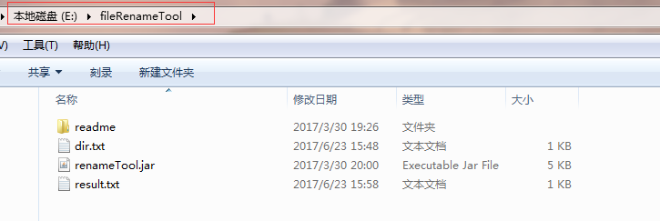

# FileRename
批量重命名文件工具，供学习参考。

# 使用场景

举例说明，如果文件夹文件名称都如下格式：

	20170627_1807_app_ccc_v1.1.0_1.apk
	20170627_1807_app_ccc_v1.1.0_2.apk
	20170627_1807_app_ccc_v1.1.0_3.apk
	20170627_1807_app_ccc_v1.1.0_4.apk
	...
	20170627_1807_app_ccc_v1.1.0_10.apk

可以通过工具，批量修改为如下文件：

	v1.1.0_1.apk
	v1.1.0_2.apk
	v1.1.0_3.apk
	v1.1.0_4.apk
	...
	v1.1.0_10.apk

# 使用方式

1、写个配置目录，如dir.txt，主要配置需要重命名的文件夹目录名称。

2、写个结果文件，如result.txt，里面会返回重命名是否成功。

3、最好加上一个reamd.me，简单介绍。

4、当然最重要的是将程序生成一个可执行jar啦， 也可以写成GUI，提供配置界面。

如下图：

# 关于我

有任何使用问题，可以给我发邮件：

Author：张利峰

E-mail：519578280@qq.com

# License

    Copyright(c)2017 xyzlf Open Source Project
    
    Licensed under the Apache License, Version 2.0 (the "License");
    you may not use this file except in compliance with the License.
    You may obtain a copy of the License at
    
    http://www.apache.org/licenses/LICENSE-2.0
    
    Unless required by applicable law or agreed to in writing, software
    distributed under the License is distributed on an "AS IS" BASIS,
    WITHOUT WARRANTIES OR CONDITIONS OF ANY KIND, either express or implied.
    See the License for the specific language governing permissions and
    limitations under the License.